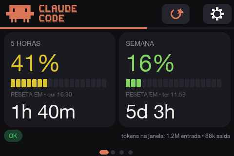
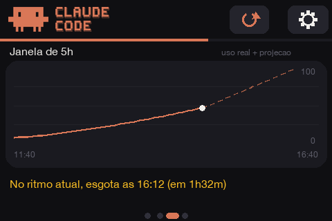
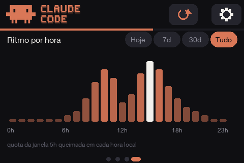
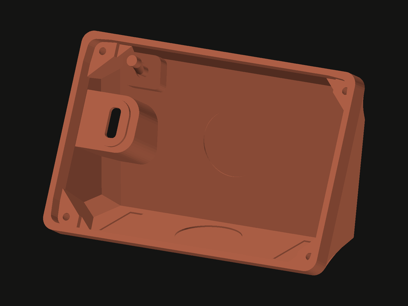
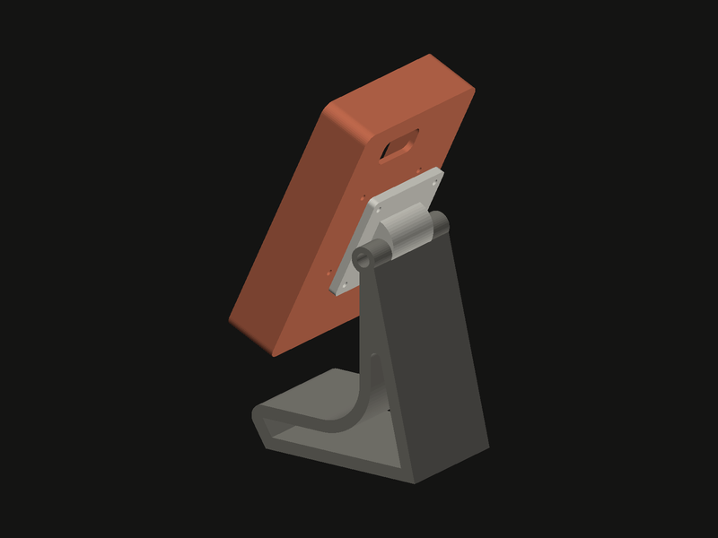
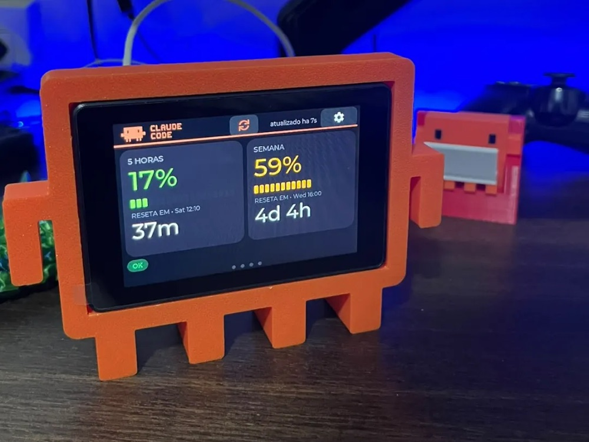

<div align="center">


# Claude Usage Stick

**Seus limites de uso do Claude Code, ao vivo numa tela touch de 3,5".**<br>
Sem computador. Sem app. Sem nuvem.

[English](README.md) · **Português**




</div>

O device consulta a API da Anthropic diretamente, lê o seu uso dos próprios cabeçalhos da resposta
e desenha tudo num painel — mascotes **Clawd** animados, projeção de consumo, mapa de calor por
hora do dia, relógios de reset e **até 4 contas** que você alterna na própria tela.

> Navegação 100% touch (swipe ← → entre as telas, sem botão físico). Adaptado do projeto original
> **Claude Usage Stick** (um firmware multi-placa com botões físicos) para rodar **só nesta
> tela** — veja [O que veio do projeto original](#o-que-veio-do-projeto-original).

> A interface do device é em português. Este README é a versão em português da documentação; o
> [README em inglês](README.md) é o principal do projeto.

---

## Colocando um para funcionar


Tudo o que você precisa está neste repositório: o código do firmware, a placa exata, o mapa de
pinos e os comandos de build. Gravar você mesmo com o `arduino-cli` está documentado em
[Compilar e gravar](#compilar-e-gravar) e **não custa nada**.

### Não quer instalar um toolchain?

<a href="https://usagestick.autom.my"></a>

Se você está sem tempo — ou simplesmente não quer lidar com `arduino-cli`, pacotes de placa e
bibliotecas — existe um gravador hospedado em
**[usagestick.autom.my](https://usagestick.autom.my)**. Crie uma conta, conecte a placa no USB e o
Chrome grava o firmware direto nela via Web Serial. Leva cerca de um minuto e não instala nada na
sua máquina.

Esse serviço cobra uma **taxa única por placa**, que paga a hospedagem e o trabalho de construir a
facilidade. Para deixar explícito o que está sendo vendido:

- **Você não está pagando pelo firmware.** Ele é aberto, está aqui, e você pode compilar e gravar
  de graça, para sempre, sem criar conta nenhuma.
- A taxa cobre **a conveniência** de fazer isso pelo navegador. É totalmente opcional.
- Um pagamento vale por **uma placa, para sempre** — incluindo versões futuras do firmware nela.

Se você se vira bem num terminal, pule isso e vá para [Compilar e gravar](#compilar-e-gravar).

---

## Telas

> As imagens abaixo são **mockups fiéis ao pixel**, renderizados a partir do próprio layout e da
> paleta do firmware (fotos reais do device em breve). Correspondem à v2.4, exceto que as três telas de swipe não
> mostram o selo `@label` da conta, que aparece no cabeçalho quando você adiciona a segunda.

Navegue por **swipe** (os pontinhos embaixo mostram onde você está; o ativo vira uma pílula). A
**engrenagem** abre os Ajustes. A **barra coral fina** abaixo do cabeçalho escoa até o próximo
refresh — tocar nela atualiza na hora.

### 1. Agora


- Dois cartões grandes: **janela de 5 horas** e **janela da semana (7 dias)**.
- Cada cartão traz: porcentagem grande e um **medidor de 18 segmentos** cujos segmentos acesos (e o
  número) deslizam continuamente do **verde ao âmbar e ao vermelho** conforme a janela enche, mais
  uma **contagem regressiva grande e ao vivo** até o reset e o **horário local do reset**.
- Faixa inferior: **chip de status** geral (`OK` / `ATENCAO` / `BLOQUEADO`) e, quando a
  [ponte de tokens](#tokens-por-sessão-ponte-opcional) está rodando, a **contagem real de tokens**
  da janela de 5 h atual.

<br clear="right">

### 2. Janela de 5h


- Gráfico próprio com o **eixo X cobrindo exatamente a janela de 5 h atual** (início → reset).
- Linha coral sólida = histórico real de uso; **linha pontilhada = projeção** no ritmo atual.
- Veredito em linguagem simples, com cor: *"No ritmo atual, acaba as 16:40 (em 1h32m)"* (âmbar ou
  vermelho) ou *"NAO acaba antes do reset (~62%)"* (verde).

<br clear="right">

### 3. Ritmo por hora


- **Uso por hora do dia**: 24 barras cuja altura e brilho mostram quais horas queimam mais quota; a
  hora atual fica destacada.
- **Seletor de período** no topo: **Hoje / 7d / 30d / Tudo**. O histórico por dia é **persistido em
  flash** (31 dias no device).

<br clear="right">

### Momentos de limiar (animações)


Sempre que uma janela cruza **25% / 50% / 70% / 100%**, um "momento" animado toma a tela inteira
(8 combinações: 4 limiares × 2 janelas): o **Clawd** oficial em pixel art entra em cena e reage ao
nível — relaxado aos 25%, concentrado com uma gota de suor aos 50%, de olhos arregalados e tremendo
aos 70%, acinzentado com olhos de X e um anel vermelho piscando aos 100% — enquanto a porcentagem
sobe contando e um medidor de segmentos acende. Toque para dispensar (fecha sozinho em ~4,5 s).

> **Toque duas vezes no ícone do Clawd ou na marca CLAUDE CODE** para ver as 8 animações em
> sequência. O **botão de refresh** fica no centro do cabeçalho (a barra coral fina abaixo dele é
> só o indicador de contagem).

O cabeçalho e as telas de token/carregamento usam o **logo oficial do Claude Code em pixel** (SVGs
em `assets/brand/`, convertidos em imagens LVGL embutidas por `tools/gen_logo_assets.py`).

<br clear="right">

### Ajustes

Abertos pela engrenagem (lista rolável, linhas de toque de 44 px):

- **Atualizar agora** — força um refresh.
- **Intervalo de atualização** — 15 s / 30 s / 1 min / 2 min / 5 min (toque para alternar; salvo na NVS).
- **Mascote semanal** — o card SEMANA alterna a cada atualização entre o consumo semanal e o Clawd animado; toque para alternar **Clawd / rodízio** (os 4 modelos com adereço) **/ humor** (segue o uso semanal) **/ desligado**.
- **Slideshow** — avança as telas sozinho; toque para alternar **off / 5 s / 10 s / 15 s / 30 s**
  (pausa por 10 s depois de qualquer toque).
- **Fuso: GMT±N** — ajusta o fuso horário (toque para alternar; corrige os relógios de reset).
- **Brilho** — baixo / médio / alto (PWM do backlight).
- **Configurar WiFi** — nova varredura + senha na tela.
- **Contas** — até 4 contas Claude (por exemplo pessoal + trabalho); toque num slot para trocar qual
  delas o device monitora, adicione pelo formulário web (com um rótulo próprio), renomeie na tela
  (lápis), remova com 2 toques.
- **Trocar token** — reabre a entrada de token pela web (substitui o token da conta ativa).
- **Idioma** — português / inglês, aplicado a toda a interface (salvo na NVS).
- **Sobre** — informações do device, modelo da tela e créditos.
- **Apagar tudo** — reset de fábrica (2 toques para confirmar).

### Contas


Tem uma assinatura Claude pessoal **e** uma do trabalho? O device guarda **até 4**, cada uma com seu
rótulo e seu slot criptografado, todas atrás do mesmo PIN.

- **Toque numa linha para trocar.** A ativa fica coral e marcada como *ativa*. A troca substitui o
  token e o histórico/mapa de calor daquela conta, e atualiza na hora — sem pedir o PIN, porque a
  sessão já destravou.
- **Só a conta ativa é consultada.** As outras ficam completamente dormentes: **zero requisições à
  API**. Isso importa numa conta corporativa, onde cada consulta é visível para os admins da sua
  organização.
- **O lápis renomeia** na tela; nomes repetidos ganham um sufixo " 2" automaticamente, porque a
  [ponte de tokens](#tokens-por-sessão-ponte-opcional) identifica as contas pelo rótulo.
- **A lixeira remove** (2 toques para confirmar), e ela não deixa você apagar a última.
- **+ Adicionar conta** reaproveita o formulário web, que agora recebe um rótulo junto do token.

Quando existe mais de uma conta, o cabeçalho do painel mostra um selo `@rótulo` para você sempre
saber qual está vendo.

<br clear="right">

---

## Hardware

| | |
|---|---|
| Tela | **Mini ESP32-S3 3.5" Capacitive Touch IPS · 480×320 · 8 MB PSRAM · 16 MB Flash** ([AliExpress](https://s.click.aliexpress.com/e/_c4T3hoZp)) |
| Chip | ESP32-S3 (USB nativo) |
| Display | **AXS15231B**, interface QSPI |
| Touch | **AXS15231B** capacitivo, I²C `0x3B` |

> **Aviso:** o link do AliExpress acima é um link de afiliado. Você não paga nada a mais, e a pequena
> comissão volta direto para manter este projeto vivo e atualizado. Comprar a placa por ele é uma
> forma simples de contribuir — obrigado!

> **No Brasil?** Fornecedor local entrega em dias, não em semanas. A [Fikra](https://fikra.com.br/esp32/) trabalha com essa
> placa — o estoque é limitado, então ela pode aparecer como indisponível — e, para quem quer
> agilidade na entrega, tem também este [anúncio no Mercado Livre](https://www.mercadolivre.com.br/esp32s3-bluetooth-wifi-display-35--usbc/up/MLBU4794234738).

> **PSRAM OPI é obrigatória** — o buffer LVGL de 480×320 não cabe na RAM interna.

Os pinos e a configuração validada de display/cores/touch estão em
[`firmware/REFERENCIA-HARDWARE-LVGL.md`](firmware/REFERENCIA-HARDWARE-LVGL.md), e o sketch de
bring-up de referência em [`firmware/bringup/`](firmware/bringup/).

---

## Cases para impressão 3D

Três jeitos de colocar na mesa. Os dois primeiros vêm neste repositório em STL; o terceiro é um
projeto da comunidade.

<table>
  <tr>
    <td align="center" valign="top" width="33%"><br><b>Cunha de mesa</b></td>
    <td align="center" valign="top" width="33%"><br><b>Suporte articulado</b></td>
    <td align="center" valign="top" width="33%"><a href="https://makerworld.com/pt/models/3329534-case-claude-para-display-esp32-mascote"></a><br><b>Clawd</b> — por Vinicius Alfonso</td>
  </tr>
</table>

- **Cunha de mesa** — [`3D Case/Case_JC3248W535C.stl`](3D%20Case/Case_JC3248W535C.stl). Peça única:
  imprima, encaixe a placa e o Usage Stick está pronto para a mesa.
- **Suporte articulado** — [`3D Case/Articulado/`](3D%20Case/Articulado/). Quatro peças — base,
  junção, case e suporte do display — para inclinar a tela no ângulo que a sua mesa pedir.
- **Clawd** — o próprio mascote, com braços e pernas, segurando a tela. Criado por
  **Vinicius Alfonso** (@vinnialfonso) e publicado no MakerWorld; a foto é a impressão dele rodando
  este firmware. Não vem no repositório —
  [baixe no MakerWorld](https://makerworld.com/pt/models/3329534-case-claude-para-display-esp32-mascote).

Fez o seu próprio case? Abra um PR adicionando à lista.

---

## Como funciona (e o token)

O gadget faz um `POST` **mínimo** (`max_tokens: 1`) para
`https://api.anthropic.com/v1/messages` e **não usa o corpo da resposta** — ele lê o uso direto dos
cabeçalhos:

```
anthropic-ratelimit-unified-status                allowed | allowed_warning | rejected
anthropic-ratelimit-unified-5h-utilization        0–1   (vira a % da janela de 5 horas)
anthropic-ratelimit-unified-5h-reset              epoch
anthropic-ratelimit-unified-7d-utilization        0–1   (janela de 7 dias)
anthropic-ratelimit-unified-7d-reset              epoch
anthropic-ratelimit-unified-representative-claim  five_hour | seven_day  (o que te limita primeiro)
anthropic-ratelimit-unified-fallback-percentage
anthropic-ratelimit-unified-overage-status / -overage-disabled-reason
```

### Tokens por sessão (ponte opcional)

A API **não** expõe contagem de tokens para contas de assinatura — os cabeçalhos `unified-*` só
trazem porcentagens de utilização, e `/api/oauth/usage` exige o escopo `user:profile` (o
`setup-token` só tem `user:inference`) e ainda assim devolve porcentagens. Os números reais vivem
nos **transcripts locais do Claude Code** (`~/.claude/projects/**/*.jsonl`).

O [`tools/token_bridge.py`](tools/token_bridge.py) (só stdlib) fecha essa lacuna: ele pergunta ao
device qual é a janela atual (`GET http://claude-stick.local/window`), soma as entradas `usage` dos
transcripts desde o início da janela (deduplicadas por id de mensagem) e devolve o total
(`POST /tokens`). A tela "Agora" passa a mostrar *"tokens na janela: 1.2M entrada • 88k saida"*.

```bash
python3 tools/token_bridge.py               # uma vez
python3 tools/token_bridge.py --loop 120    # continua enviando a cada 2 min
```

O device se anuncia por mDNS como **`claude-stick.local`** enquanto o painel está aberto. Se a
linha sumir, é porque o dado ficou velho (> 15 min sem envio).

#### Mantendo rodando via hook do Claude Code (alternativa ao cron)

Se o seu uso principal da ponte é com o **Claude Code CLI**, não precisa de um cron do sistema: um
hook `SessionStart` pode iniciá-la sozinha na primeira vez que você abre uma sessão. Depois de
iniciada ela segue rodando em segundo plano até você encerrar a sessão do sistema ou reiniciar
(para parar antes: `pkill -f token_bridge.py`); o log vai para `~/Library/Logs/` no macOS e
`~/.local/state/` no Linux, ou para onde `CLAUDE_STICK_BRIDGE_LOG` apontar.

O [`tools/claude-code-token-bridge-hook.sh`](tools/claude-code-token-bridge-hook.sh) é um helper
pronto que verifica (via `pgrep`) se a ponte já está rodando antes de iniciar, então abrir várias
abas/sessões de terminal nunca duplica o loop. Basta ligar ele no `~/.claude/settings.json`:

```json
{
  "hooks": {
    "SessionStart": [
      {
        "hooks": [
          {
            "type": "command",
            "command": "bash /caminho/absoluto/para/claude-usage-stick-SVGL/tools/claude-code-token-bridge-hook.sh",
            "timeout": 15
          }
        ]
      }
    ]
  }
}
```

Para várias contas, defina `CLAUDE_STICK_BRIDGE_ACCOUNT` com o rótulo configurado no device antes
do Claude Code iniciar (por exemplo no seu perfil do shell) — mesma ideia da flag `--account` acima.

> **Não embuta a lógica do `pgrep`/`nohup` direto na string `command` do hook.** O processo que
> executa o comando do hook carrega, no seu próprio argv, o texto de busca (já que ele faz parte
> do próprio comando) — e o `pgrep -f` pode acabar encontrando a si mesmo intermitentemente em vez
> do processo real da ponte, deixando de iniciá-la sem avisar nada. Manter a lógica num arquivo de
> script separado evita isso, já que a invocação do script
> (`bash .../claude-code-token-bridge-hook.sh`) não contém o padrão sendo buscado.

Com várias contas, rode uma ponte por máquina com `--account <rótulo>` (o rótulo configurado no
gadget). O `GET /window` informa qual conta está ativa; um envio para outra conta recebe `409` e é
simplesmente ignorado até aquela conta voltar a ser a ativa.

```bash
python3 tools/token_bridge.py --account Trabalho --loop 120   # notebook do trabalho
python3 tools/token_bridge.py --account Pessoal --loop 120    # máquina pessoal
```

### Várias contas

O device guarda até **4 contas** (rótulo + token), cada uma criptografada no seu próprio slot da
NVS com o mesmo PIN. Só a conta **ativa** é consultada — as outras ficam dormentes, gerando **zero
tráfego de API**. Trocar (Ajustes → Contas) leva dois toques: o device descriptografa o slot, troca
o histórico/mapa de calor da conta (`/hist0.bin`..`/hist3.bin` no LittleFS) e atualiza na hora. O
cabeçalho do painel mostra um selo `@rótulo` sempre que existe mais de uma conta.

Atenção para contas corporativas: cada consulta é uma requisição real (mínima) à API, visível para
os admins da sua organização como qualquer uso do Claude Code.

**Atualizando um device que já roda a v2.1?** Nada se perde e nada é pedido de você. O primeiro
boot move o token guardado para o slot 0 (rotulado "Conta 1") e dá a ele uma cópia do histórico
existente. Os dois originais são **mantidos** de propósito, então voltar para a v2.1 encontra tudo
onde estava — a migração só acrescenta. E gravar não toca nas partições `nvs` nem `spiffs` de todo
modo; só a partição da aplicação é reescrita.

### Gerando o token (`claude setup-token`)

Num terminal, com o **Claude Code** instalado e logado na sua assinatura (**Pro** ou **Max**):

```bash
claude setup-token
```

Isso abre um fluxo **OAuth** no navegador; você autentica com sua conta Anthropic e recebe um
**token de longa duração** no formato `sk-ant-oat01-…`.

Ele foi pensado para ambientes **sem login interativo** (CI/CD, GitHub Actions, scripts headless) —
o uso típico é como variável de ambiente:

```bash
export CLAUDE_CODE_OAUTH_TOKEN="sk-ant-oat01-..."
```

**⚠️ Ressalva importante:** esse é um token do **Claude Code**. Uma chamada "crua" à Messages API
(`/v1/messages`) com ele normalmente é **rejeitada**.

**Como este gadget contorna isso:** ele manda exatamente os cabeçalhos que o Claude Code manda —
`anthropic-beta: oauth-2025-04-20` mais o `User-Agent` do Claude Code — numa requisição
`max_tokens: 1`. A API então responde **200** e devolve os cabeçalhos de rate limit (validado
contra uma conta real). Como o corpo é descartado e é só 1 token, o **consumo de quota é
desprezível**.

> O token é digitado **uma vez** (pela web, veja abaixo) e guardado **criptografado** no device.

### 🚨 Leia isto antes de usar um token de assinatura

**A Anthropic não permite tokens OAuth de assinatura em ferramentas de terceiros.** Numa política
formalizada em **4 de abril de 2026**, a Anthropic afirmou que o OAuth de Free/Pro/Max — a
credencial que o `claude setup-token` produz — se destina **apenas** ao Claude Code e ao claude.ai,
e que usá-la em qualquer outro produto, ferramenta ou serviço viola os Termos ao Consumidor. Há
relatos de aplicação da regra no servidor desde janeiro de 2026.

Este firmware é uma ferramenta de terceiros, e a solução descrita logo acima — imitar o cliente
Claude Code pelos cabeçalhos e pelo User-Agent — é exatamente o padrão de que a política trata.

**O que isso significa na prática:**

- **Funciona hoje.** Uma placa foi gravada em agosto de 2026 e mostra dados reais. Mas *funcionar*
  não é *ser permitido*.
- A exposição é da **sua conta**, não do projeto. Relatos públicos de aplicação incluem falhas de
  autenticação e interrupção de conta.
- A Anthropic pode mudar a API ou bloquear o padrão a qualquer momento, e o device simplesmente
  pararia de mostrar números.

Este projeto não tem vínculo com a Anthropic e não fala por ela. Ele é publicado para que as
pessoas possam construí-lo, ler o código e decidir por si mesmas. **Se você não está disposto a
aceitar esse risco na sua própria conta, não use um token de assinatura com este firmware.**

Fontes, levantadas em 13 de agosto de 2026:
[The Register](https://www.theregister.com/2026/02/20/anthropic_clarifies_ban_third_party_claude_access/) ·
[WinBuzzer](https://winbuzzer.com/2026/02/19/anthropic-bans-claude-subscription-oauth-in-third-party-apps-xcxwbn/)

---

## Compilar e gravar

> Prefere não montar nada disso? O [usagestick.autom.my](https://usagestick.autom.my) grava a placa
> pelo Chrome, sem instalar nada — veja
> [Não quer instalar um toolchain?](#não-quer-instalar-um-toolchain). O caminho abaixo é o gratuito
> e sempre será.

Pré-requisitos (versões testadas):

- `arduino-cli` 1.4.x · core `esp32:esp32` **3.3.11**
- bibliotecas: **GFX Library for Arduino** 1.6.5 · **lvgl** 9.2.2

```bash
cd firmware/claude_stick
./build.sh                 # compila
./build.sh upload          # compila + grava (porta padrão /dev/cu.usbmodem101)
./build.sh upload /dev/cu.usbmodemXXXX
./build.sh monitor /dev/cu.usbmodemXXXX
```

FQBN: `esp32:esp32:esp32s3:PSRAM=opi,FlashSize=16M,PartitionScheme=custom,CDCOnBoot=cdc,USBMode=hwcdc,FlashMode=qio`

O `build.sh` passa `-DLV_CONF_INCLUDE_SIMPLE -I<sketch>` para o LVGL achar o `lv_conf.h` do sketch.
Se você receber `lv_conf.h not found`, copie `firmware/claude_stick/lv_conf.h` para a pasta de
bibliotecas do Arduino (um nível acima da pasta `lvgl`) — copie **este** arquivo, não um mais
antigo: o `#include <stdint.h>` dele está dentro de uma guarda `#ifndef __ASSEMBLY__`, sem a qual o
build morre ao montar os `lv_blend_helium.S` / `lv_blend_neon.S` do lvgl:

```
xtensa-esp-elf/include/stdint.h:21: Error: unknown opcode or format name 'typedef'
```

Essa guarda é o que o próprio `lv_conf_template.h` do lvgl prescreve, e ela é necessária porque o
`lv_conf_internal.h` puxa o `lv_conf.h` *inclusive durante a montagem* daqueles arquivos `.S`.

Uma sutileza que vale conhecer se você compila outros sketches nesta placa: o `-I` acima viaja em
`compiler.c/cpp.extra_flags`, e o core ESP32 monta arquivos `.S` com `compiler.S.extra_flags`. Um
sketch que traz o próprio `lv_conf.h` fica bem (a pasta do sketch está no include path de qualquer
jeito), mas um sketch **sem** ele cai no `../../lv_conf.h` do lvgl — aquele arquivo solto em
`libraries/`, que pode muito bem pertencer a outro projeto. Se você bater no erro acima a partir de
um sketch sem `lv_conf.h`, passe o `-I` também em `compiler.S.extra_flags`; o
`firmware/bringup/build.sh` faz exatamente isso.

Para compilar o sketch de bring-up, use o script dele — `firmware/bringup/build.sh`. Aquela pasta
não tem `partitions.csv` nem `lv_conf.h`, então a FQBN do firmware não se aplica a ela.

> Se as cores saírem com vermelho e azul trocados, mude `LV_COLOR_16_SWAP` para `1` no `lv_conf.h`.

---

## Primeira configuração (onboarding)

Tudo pela tela / rede — sem precisar recompilar:

1. **WiFi** — toque na sua rede e digite a senha (teclado na tela). Guarda até 3 redes na NVS.
2. **Token** — a tela mostra o **IP do gadget** (por exemplo `http://192.168.0.42`) com um ícone
   animado do Claude. Abra esse endereço **no seu PC ou celular na mesma rede**, opcionalmente dê um
   **rótulo** à conta (*Pessoal*, *Trabalho*) e **cole o token** no formulário. O device **valida**
   o token na hora (com uma chamada real à API) antes de aceitá-lo.
3. **PIN** — defina um PIN de 4 dígitos (digitado duas vezes para confirmar). O token é
   criptografado com ele.

A cada boot seguinte, o device pede apenas o **PIN** para descriptografar o token. Contas extras
adicionadas depois (Ajustes → Contas) reaproveitam o mesmo formulário e são criptografadas com o
mesmo PIN — sem pedir o PIN de novo durante a sessão.

---

## Segurança

- Os tokens são guardados **criptografados** (AES-256-GCM; chave derivada do PIN via SHA-256), um
  slot de NVS por conta, todos sob o **mesmo PIN**. O PIN **nunca** é armazenado — um PIN errado
  significa que a tag GCM não confere.
- Depois de 10 tentativas erradas, as credenciais são **apagadas** e o device volta ao onboarding
  (cada falha dobra o tempo de bloqueio).
- O histórico/mapa de calor vive num arquivo **LittleFS**, um por conta (ele não contém o token).
- O PIN fica na RAM durante a sessão para que trocar de conta não peça de novo. Isso não enfraquece
  o modelo: o token ativo já está descriptografado na RAM de qualquer forma. Nada é escrito na NVS,
  e um reset de fábrica limpa tudo.
- `.env` e `.mcp.json` estão no `.gitignore` — **nenhum segredo vai para o git**.

---

## O que veio do projeto original

Este é um fork do **Claude Usage Stick** (um firmware multi-placa com botões físicos). A **mecânica
de dados foi reaproveitada** e toda a **camada de hardware/UI foi reescrita** para esta tela.

**Reaproveitado do original (adaptado):**

- A ideia central de **ler o uso dos cabeçalhos** `anthropic-ratelimit-unified-*` com um `POST`
  mínimo (`firmware/claude_stick/api.cpp`).
- A busca de **saúde dos modelos** no `status.claude.com` (`status.cpp`).
- A **criptografia do token** AES-256-GCM + chave derivada do PIN (`crypto.cpp`).
- O **bundle de CAs** para HTTPS (`certs.cpp`).
- O conceito do produto e os **mascotes Clawd** / a fileira de status dos modelos.

**Reescrito / novo nesta versão:**

- **UI em LVGL 9** para a tela touch (tileview com swipe + pontinhos, cartões, mascotes com braços e
  pernas, gráfico, mapa de calor) — no lugar do TFT_eSPI/U8g2 multi-placa.
- **Build com arduino-cli** para o ESP32-S3 (no lugar do PlatformIO multi-placa).
- **Navegação por toque** em vez de botões físicos.
- **Onboarding na tela + entrada do token pela web** (IP local) em vez de portal cativo.
- Parsing **completo** dos cabeçalhos (status, `representative-claim`, overage, fallback).
- **Refresh em segundo plano**, **histórico/mapa de calor persistidos** (LittleFS), **fuso horário
  configurável**.

---

## Estrutura do repositório

```
firmware/
  claude_stick/                 # o firmware (sketch do arduino-cli)
    claude_stick.ino            # setup/loop, máquina de estados, painel, telas
    api.cpp/.h                  # fetchUsage() — uso via cabeçalhos da API
    status.cpp/.h               # fetchModelStatus() — saúde dos modelos
    crypto.cpp/.h               # AES-256-GCM + chave derivada do PIN
    accounts.cpp/.h             # slots de conta na NVS (multi-conta)
    certs.cpp/.h                # bundle de CAs para HTTPS
    wifi_manager.h              # redes salvas na NVS (até 3)
    touch.h                     # driver do AXS15231B
    config.h                    # pinos + endpoints + constantes
    lv_conf.h                   # configuração do LVGL 9.2
    partitions.csv              # partição de 16 MB (app + nvs + LittleFS)
    build.sh                    # compilar / gravar / monitorar
  bringup/                      # bring-up validado (referência de hardware)
    build.sh                    # FQBN própria — veja Compilar e gravar
  REFERENCIA-HARDWARE-LVGL.md   # display/cores/touch que funcionam
tools/
  token_bridge.py               # envia a contagem local de tokens ao device
  claude-code-token-bridge-hook.sh  # hook SessionStart que mantém a ponte rodando
  gen_logo_assets.py            # SVGs da marca -> logo_assets.h
  partner_logo.py               # grava um logo num .bin já compilado (ver build.sh --logo)
assets/                         # mockups das telas, banners do README + marca (brand/)
3D Case/                        # cases imprimíveis (STL) para a placa
docs/                           # notas e planos (ex.: porte do firmware para outras placas)
```

## Onde mexer

- **Intervalo de consulta, endpoints, PIN, fuso:** pela tela (Ajustes) ou em `config.h`.
- **Cores do tema / layout:** topo do `claude_stick.ino` (paleta) e os construtores `build_tile_*`.
- **Mascotes:** `build_mascot()` no `claude_stick.ino`.

---

## Créditos

Fork do **Claude Usage Stick** original. O firmware desta versão foi reescrito para a tela LVGL
480×320 do ESP32-S3. Não é um produto oficial da Anthropic.

### Contribuidores

Por um tempo este projeto compilava em exatamente uma máquina no mundo — a minha. Obrigado a quem
descobriu isso e corrigiu, e a quem ensinou um truque novo a ele:

<table>
  <tr>
    <td align="center" valign="top" width="20%"><a href="https://github.com/oauramos"><br><sub><b>@oauramos</b></sub></a><br><sub><i>projeto original</i></sub></td>
    <td align="center" valign="top" width="20%"><a href="https://github.com/jzimath-lab"><br><sub><b>@jzimath-lab</b></sub></a><br><sub><a href="https://github.com/benevid/claude-usage-stick-SVGL/pull/1">#1</a></sub></td>
    <td align="center" valign="top" width="20%"><a href="https://github.com/renanravelli"><br><sub><b>@renanravelli</b></sub></a><br><sub><a href="https://github.com/benevid/claude-usage-stick-SVGL/pull/2">#2</a></sub></td>
    <td align="center" valign="top" width="20%"><a href="https://github.com/mpsd18"><br><sub><b>@mpsd18</b></sub></a><br><sub><a href="https://github.com/benevid/claude-usage-stick-SVGL/pull/3">#3</a></sub></td>
    <td align="center" valign="top" width="20%"><a href="https://github.com/ViniciusLoureiro67"><br><sub><b>@ViniciusLoureiro67</b></sub></a><br><sub><a href="https://github.com/benevid/claude-usage-stick-SVGL/pull/4">#4</a></sub></td>
  </tr>
</table>

- **[@jzimath-lab](https://github.com/jzimath-lab)** — [#1](https://github.com/benevid/claude-usage-stick-SVGL/pull/1),
  merged. Rastreou por que o firmware não compilava em lugar nenhum: o `#include <stdint.h>` do
  `lv_conf.h` precisa de uma guarda `#ifndef __ASSEMBLY__`, porque o `lv_conf_internal.h` puxa esse
  header *durante a montagem* dos arquivos `.S` do lvgl. Também percebeu que
  `AXS15231B_Touch::_instance` é uma definição dentro de um header, o que só passou despercebido
  enquanto o sketch era uma única unidade de tradução.
- **[@mpsd18](https://github.com/mpsd18)** — [#3](https://github.com/benevid/claude-usage-stick-SVGL/pull/3).
  Chegou à mesma causa raiz de forma independente e explicou a peça que mais ninguém explicou: o
  include path viaja em `compiler.c/cpp.extra_flags`, enquanto o core ESP32 monta arquivos `.S` com
  `compiler.S.extra_flags`. É por causa dessa análise que o `firmware/bringup/build.sh` passa a flag
  nos três, e é a razão de o fallback do Windows em *Compilar e gravar* estar documentado como está.
- **[@ViniciusLoureiro67](https://github.com/ViniciusLoureiro67)** — [#4](https://github.com/benevid/claude-usage-stick-SVGL/pull/4).
  Uma terceira confirmação independente, num JC3248W535C, e fechou a duplicata por conta própria,
  apontando para a #1. Três pessoas chegando à mesma causa a partir de três ambientes é o que tornou
  óbvio que o problema estava aqui, não lá.
- **[@renanravelli](https://github.com/renanravelli)** — [#2](https://github.com/benevid/claude-usage-stick-SVGL/pull/2),
  merged. Suporte a múltiplas contas: até 4 contas, só a ativa consultada, histórico por conta,
  renomear na tela e a flag `--account` na ponte de tokens.
